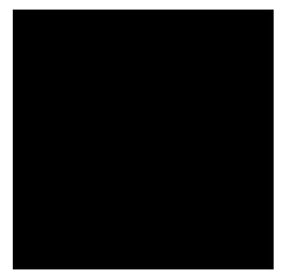

# Brain Tumor Segmentation

Training and evaluation code for brain tumor segmentation on Flair MRI images




Recommended way of project installation is below. 
To install all libraries locally read [MANUAL_INSTALLATION.md]

## Installation


## Data

You can download dataset from [here](https://www.kaggle.com/dschettler8845/brats-2021-task1). 
Unzip data to some folder. Folders structure is provided below:

```
.
```


## Weights&Biases logging

To use MLFlow you need to change [train config file](configs/train_config.yaml) in `trainer` section. Example:
```yaml
...
logger:
  - class_path: pytorch_lightning.loggers.WandbLogger
    init_args:
      name: tumor-segmentation-densevnet
      project: tumor-segmentation
      log_model: True
...
```

You need to change `name` to your own. During first setup `wandb` will ask you to insert your own credentials. 
You can get those from [here](https://wandb.ai/settings).

## Usage

### Config

To train models you need to have only one config file:
 * [Train config file](configs/train_config.yaml)

### Scripts

Script for **training**:

```
python train.py --config configs/train_config.yaml
```
*IMPORTANT:* all folders should be accessible to the user, which executes scripts.

If you want to disable logging. And to leave only standart `TensorBoardLogger`. Use this script:
```
python train.py --config configs/train_config.yaml --trainer.logger true
```
*IMPORTANT:* argument `--trainer.logger` must be set after `--config`.


Script for **app evaluation**:

```
python evalualte.py \
    --checkpoint-path /checkpoints/best_checkpoint.ckpt \
    --ct-path /data/ct_image.nii.gz \
    --device-type cuda
```

This scripts starts simple OpenCV app. In this app you can interactively check model result.


## Built With

* [PyTorch](https://pytorch.org) - The NNs framework used
* [pytorch-lightning](https://www.pytorchlightning.ai) - Train loop framework used
* [MONAI](https://github.com/Project-MONAI/MONAI) - Framework for deep learning in healthcare imaging

## Authors

* **Vadim Titko** aka *Vadbeg* -
[LinkedIn](https://www.linkedin.com/in/vadtitko/) |
[GitHub](https://github.com/Vadbeg/PythonHomework/commits?author=Vadbeg)


